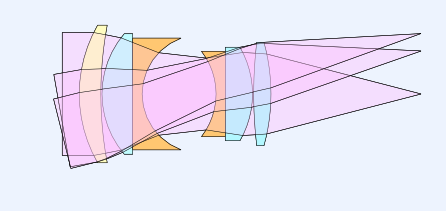

.. RayOptics documentation master file, created by
   sphinx-quickstart on Fri Sep 14 13:29:37 2018.
   You can adapt this file completely to your liking, but it should at least
   contain the root `toctree` directive.

:tocdepth: 3

#######################
RayOptics Documentation
#######################

.. toctree::
   :maxdepth: 1
   :caption: Contents

   Introduction

.. _getting-started:

.. toctree::
   :maxdepth: 1
   :caption: Getting Started

   install
   examples/TripletExample

.. _user-docs:

.. toctree::
   :maxdepth: 1
   :caption: User Guide

   userguide/models
   userguide/calc
   userguide/gui
   userguide/ipython
   userguide/jupyter
   userguide/qt

.. _dev-guide:

.. toctree::
   :maxdepth: 1
   :caption: Developer Guide

   source/rayoptics
   source/rayoptics.optical
   source/rayoptics.codev
   source/rayoptics.gui
   source/rayoptics.mpl
   source/rayoptics.qtgui
   source/rayoptics.util

*****
Index
*****

* :ref:`genindex`
* :ref:`modindex`
* :ref:`search`
