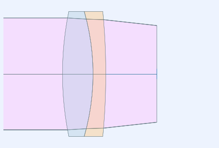
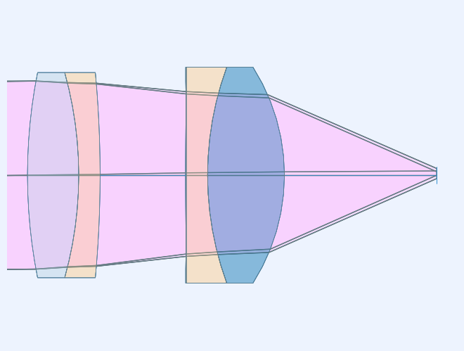
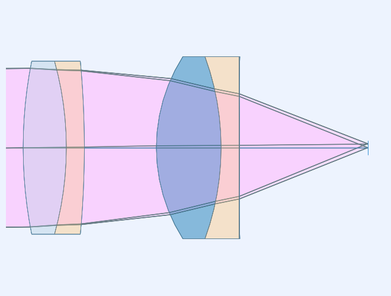
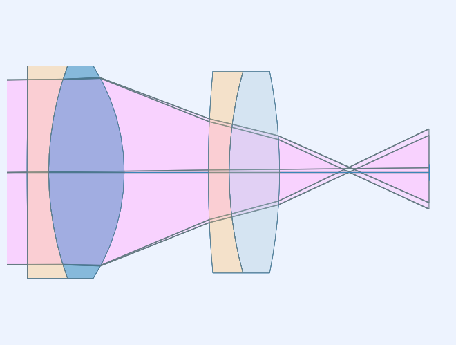

.. currentmodule:: rayoptics

############################
Multiple lens import example
############################

This notebook shows the steps to follow to open multiple vendor component files using ray-optics.

.. code:: ipython3

    %matplotlib inline

.. code:: ipython3

    # initialization
    from rayoptics.environment import *

.. code:: ipython3

    root_pth = Path(rayoptics.__file__).resolve().parent

Create a new, empty, Optical Model
----------------------------------

.. code:: ipython3

    opm = OpticalModel()
    sm = opm['seq_model']
    osp = opm['optical_spec']
    pm = opm['parax_model']
    em = opm['ele_model']
    pt = opm['part_tree']

By default, the sequential model will automatically recalculate lens apertures when the model changes. The imported lenses will have apertures defined, so turn the `do_apertures` setting off.

.. code:: ipython3

    sm.do_apertures = False

Set the object distance of the empty Optical Model to infinity (1e10 is close enough).

.. code:: ipython3

    sm.gaps[0].thi = 1e10

Listing the sequential model shows object and image interfaces and the air-filled object distance gap.

.. code:: ipython3

    sm.list_model()

.. parsed-literal::

                  c            t        medium     mode   zdr      sd
      Obj:     0.000000  1.00000e+10       air             1      1.0000
      Img:     0.000000      0.00000                       1      1.0000

Enter the Optical Specifications
--------------------------------

The usage specifications for the optical system are defined via different properties of the :class:`~.OpticalSpecs` class.

.. code:: ipython3

    osp.pupil.value=22
    listobj(osp['pupil'])

.. parsed-literal::

    aperture: object epd; value=22
    

.. code:: ipython3

    opm.update_model()

Add first component
-------------------

The parameter `t` is the spacing following the inserted component.

.. code:: ipython3

    opm.add_from_file(root_pth/"codev/tests/CODV_32327.seq", t=10.)

The listing shows the imported part is a cemented lens doublet.

.. code:: ipython3

    sm.list_model()

.. parsed-literal::

                  c            t        medium     mode   zdr      sd
      Obj:     0.000000  1.00000e+10       air             1      1.0000
    32327:     0.016268      6.00000     N-BK7             1      12.000
        2:    -0.022401      2.50000     N-SF5             1      1.0000
        3:    -0.007696      10.0000       air             1      12.000
      Img:     0.000000      0.00000                       1      1.0000

The part tree can be displayed using list_model on the part_tree.

.. code:: ipython3

    pt.list_model()

.. parsed-literal::

    root
    ├── Object
    ├── CE1
    └── Image

Generate a lens picture
-----------------------

This is done using the :mod:`.interactivelayout` module.
All graphics in rayoptics are based on matplotlib.

.. code:: ipython3

    layout_plt = plt.figure(FigureClass=InteractiveLayout, opt_model=opm,
                            do_draw_rays=True, do_paraxial_layout=False).plot()

Add the second component
------------------------

.. code:: ipython3

    opm.add_from_file(root_pth/"codev/tests/CODV_49664.seq", t=17.8)

The imported element, CE2, is a triplet with a thin, aspheric, cap.

.. code:: ipython3

    sm.list_model()

.. parsed-literal::

                  c            t        medium     mode   zdr      sd
      Obj:     0.000000  1.00000e+10       air             1      1.0000
    32327:     0.016268      6.00000     N-BK7             1      12.000
        2:    -0.022401      2.50000     N-SF5             1      1.0000
        3:    -0.007696      10.0000       air             1      12.000
    49663:     0.042553      9.00000   S-LAL 8             1      12.629
        5:    -0.027248      2.50000   S-TIH53             1      11.842
        6:     0.000000    0.0800000 517000.520000             1      11.004
        7:    -0.003096      17.8000       air             1      10.990
      Img:     0.000000      0.00000                       1      1.0000

opm.update_model()

Use the :func:`~.listobj` function to get formatted output of an object's contents.

.. code:: ipython3

    listobj(sm.ifcs[7].profile)

.. parsed-literal::

    profile: EvenPolynomial
    c=-0.003095913950326,   r=-323.006393602994   conic cnst=0.0
    coefficients: [0.0, 1.38925111836e-05, -2.08175206307e-08, 0.0, 0.0, 0.0, 0.0, 0.0, 0.0, 0.0]
    

.. code:: ipython3

    pt.list_model()

.. parsed-literal::

    root
    ├── Object
    ├── CE1
    ├── CE2
    └── Image

.. code:: ipython3

    em.list_model()

.. parsed-literal::

    0: Object (DummyInterface): Surface(lbl='Obj', profile=Spherical(c=0.0), interact_mode='dummy')
    1: CE1 (CementedElement): CementedElement: [1, 2, 3]
    2: CE2 (CementedElement): CementedElement: [4, 5, 6, 7]
    3: Image (DummyInterface): Surface(lbl='Img', profile=Spherical(c=0.0), interact_mode='dummy')

.. code:: ipython3

    layout_plt0 = plt.figure(FigureClass=InteractiveLayout, opt_model=opm,
                            do_draw_rays=True, do_paraxial_layout=False).plot()

Flipping a lens element
-----------------------

It is common that importing components in this fashion the the catalog ordering of the surfaces is not what a particular optical model needs. The :meth:`~.opticalmodel.OpticalModel.flip` can be used to flip elements and/or sequences of interfaces.

First, retrieve the element definitions from the part tree.

.. code:: ipython3

    ce1 = pt.obj_by_name('CE1')
    ce2 = pt.obj_by_name('CE2')

Flip the second cemented element.

.. code:: ipython3

    opm.flip(ce2)

.. code:: ipython3

    layout_plt1 = plt.figure(FigureClass=InteractiveLayout, opt_model=opm,
                            do_draw_rays=True, do_paraxial_layout=False).plot()

Restore the element to its original orientation.

.. code:: ipython3

    opm.flip(ce2)

.. code:: ipython3

    layout_plt2 = plt.figure(FigureClass=InteractiveLayout, opt_model=opm,
                            do_draw_rays=True, do_paraxial_layout=False).plot()

Flip operation for a range of Interfaces
----------------------------------------

Sometimes it is more convenient to specify a range of interface indices. 

.. code:: ipython3

    sm.list_model()

.. parsed-literal::

                  c            t        medium     mode   zdr      sd
      Obj:     0.000000  1.00000e+10       air             1      1.0000
    32327:     0.016268      6.00000     N-BK7             1      12.000
        2:    -0.022401      2.50000     N-SF5             1      1.0000
        3:    -0.007696      10.0000       air             1      12.000
    49663:     0.042553      9.00000   S-LAL 8             1      12.629
        5:    -0.027248      2.50000   S-TIH53             1      11.842
        6:     0.000000    0.0800000 517000.520000             1      11.004
        7:    -0.003096      17.8000       air             1      10.990
      Img:     0.000000      0.00000                       1      1.0000

If we want to flip the lens assembly end for end, we would want to flip the range of interfaces from 1 to 7.

.. code:: ipython3

    opm.flip(1,7)

.. code:: ipython3

    sm.list_model()

.. parsed-literal::

                  c            t        medium     mode   zdr      sd
      Obj:     0.000000  1.00000e+10       air             1      1.0000
        1:     0.003096    0.0800000 517000.520000             1      10.990
        2:    -0.000000      2.50000   S-TIH53             1      11.004
        3:     0.027248      9.00000   S-LAL 8             1      11.842
    49663:    -0.042553      10.0000       air             1      12.629
        5:     0.007696      2.50000     N-SF5             1      12.000
        6:     0.022401      6.00000     N-BK7             1      1.0000
    32327:    -0.016268      17.8000       air             1      12.000
      Img:     0.000000      0.00000                       1      1.0000

.. code:: ipython3

    layout_plt3 = plt.figure(FigureClass=InteractiveLayout, opt_model=opm,
                            do_draw_rays=True, do_paraxial_layout=False).plot()

All of the information is transformed by the :meth:`~.opticalmodel.OpticalModel.flip` operation; this can be seen be using :func:`~.listobj` on the 1st interface of the sequential model.

.. code:: ipython3

    listobj(sm.ifcs[1])

.. parsed-literal::

    transmit
    profile: EvenPolynomial
    c=0.003095913950326,   r=323.006393602994   conic cnst=0.0
    coefficients: [-0.0, -1.38925111836e-05, 2.08175206307e-08, -0.0, -0.0, -0.0, -0.0, -0.0, -0.0, -0.0]
    surface_od=10.990183852239241
    

