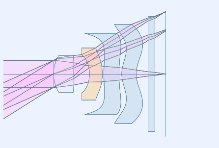
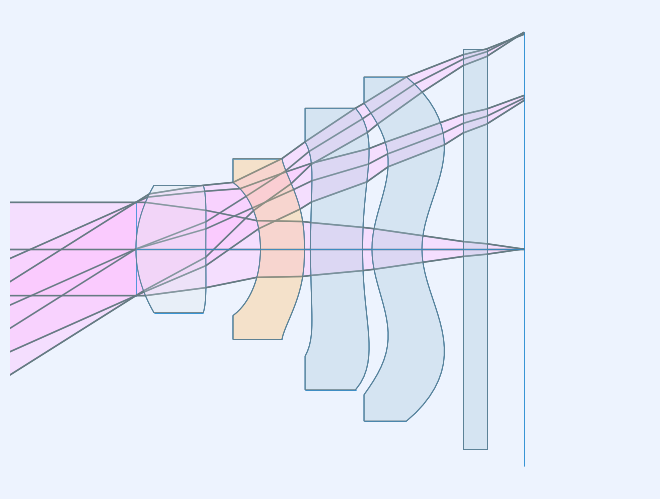
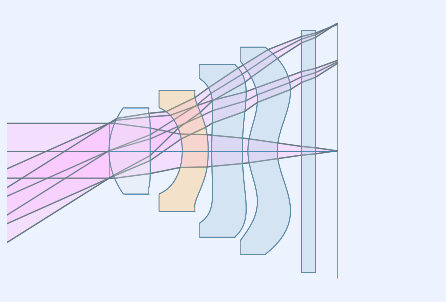
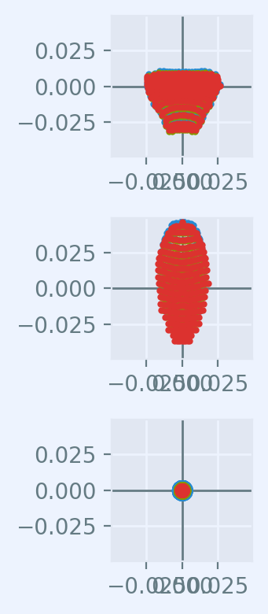

======================
Cell Phone Camera Lens
======================

From U.S. Patent 7,535,658

.. code:: ipython3

    %matplotlib inline

.. code:: ipython3

    isdark = False

.. code:: ipython3

    # use standard rayoptics environment
    from rayoptics.environment import *
    
    # util functions
    from rayoptics.util.misc_math import normalize

Create a new, empty, model
--------------------------

.. code:: ipython3

    opm = OpticalModel()
    sm = opm['seq_model']
    osp = opm['optical_spec']
    pm = opm['parax_model']
    em = opm['ele_model']
    pt = opm['part_tree']

Enter System related attributes
-------------------------------

.. code:: ipython3

    opm.system_spec.title = 'Cell Phone Lens - U.S. Patent 7,535,658'
    opm.system_spec.dimensions = 'mm'

Specify aperture, field, and wavelengths
----------------------------------------

.. code:: ipython3

    osp['pupil'] = PupilSpec(osp, key=['image', 'f/#'], value=3.5)
    osp['fov'] = FieldSpec(osp, key=['image', 'height'], value=3.5, is_relative=True, flds=[0., .7071, 1])
    osp['wvls'] = WvlSpec([('F', 0.5), ('d', 1.0), ('C', 0.5)], ref_wl=1)

Define interface and gap data for the sequential model
------------------------------------------------------

The :meth:`~.seq.sequential.SequentialModel.add_surface` method is used to enter a sequential model in the form it's usually given:

    - curvature/radius, thickness, glass/refractive index, clear aperture

Each :class:`~.elem.surface.Surface` has a profile attribute that is initialized to :class:`~.elem.profiles.Spherical`.

The :mod:`~.elem.profiles` module has a variety of non-spherical profiles. Create an instance of the desired profile type and assign it to the profile attribute of the current interface.

.. code:: ipython3

    opm.radius_mode = True
    
    sm.gaps[0].thi=1e10
    
    sm.add_surface([0., 0.])
    sm.set_stop()
    
    sm.add_surface([1.962, 1.19, 1.471, 76.6])
    sm.ifcs[sm.cur_surface].profile = RadialPolynomial(r=1.962, ec=2.153,
                            coefs=[0., 0., -1.895e-2, 2.426e-2, -5.123e-2, 8.371e-4, 7.850e-3, 4.091e-3, -7.732e-3, -4.265e-3])
    
    sm.add_surface([33.398, .93])
    sm.ifcs[sm.cur_surface].profile = RadialPolynomial(r=33.398, ec=40.18,
                            coefs=[0., 0., -4.966e-3, -1.434e-2, -6.139e-3, -9.284e-5, 6.438e-3, -5.72e-3, -2.385e-2, 1.108e-2])
    
    sm.add_surface([-2.182, .75, 1.603, 27.5])
    sm.ifcs[sm.cur_surface].profile = RadialPolynomial(r=-2.182, ec=2.105,
                            coefs=[0., 0., -4.388e-2, -2.555e-2, 5.16e-2, -4.307e-2, -2.831e-2, 3.162e-2, 4.630e-2, -4.877e-2])
    
    sm.add_surface([-6.367, 0.1])
    sm.ifcs[sm.cur_surface].profile = RadialPolynomial(r=-6.367, ec=3.382,
                            coefs=[0., 0., -1.131e-1, -7.863e-2, 1.094e-1, 6.228e-3, -2.216e-2, -5.89e-3, 4.123e-3, 1.041e-3])
    
    sm.add_surface([5.694, .89, 1.510, 56.2])
    sm.ifcs[sm.cur_surface].profile = RadialPolynomial(r=5.694, ec=-221.1,
                            coefs=[0., 0., -7.876e-2, 7.02e-2, 1.575e-3, -9.958e-3, -7.322e-3, 6.914e-4, 2.54e-3, -7.65e-4])
    
    sm.add_surface([9.192, .16])
    sm.ifcs[sm.cur_surface].profile = RadialPolynomial(r=9.192, ec=0.9331,
                            coefs=[0., 0., 9.694e-3, -2.516e-3, -3.606e-3, -2.497e-4, -6.84e-4, -1.414e-4, 2.932e-4, -7.284e-5])
    
    sm.add_surface([1.674, .85, 1.510, 56.2])
    sm.ifcs[sm.cur_surface].profile = RadialPolynomial(r=1.674, ec=-7.617,
                            coefs=[0., 0., 7.429e-2, -6.933e-2, -5.811e-3, 2.396e-3, 2.100e-3, -3.119e-4, -5.552e-5, 7.969e-6])
    
    sm.add_surface([1.509, .70])
    sm.ifcs[sm.cur_surface].profile = RadialPolynomial(r=1.509, ec=-2.707,
                            coefs=[0., 0., 1.767e-3, -4.652e-2, 1.625e-2, -3.522e-3, -7.106e-4, 3.825e-4, 6.271e-5, -2.631e-5])
    
    sm.add_surface([0., .40, 1.516, 64.1])
    sm.add_surface([0., .64])

Update the model
----------------

.. code:: ipython3

    opm.update_model()

Turn off automatically resizing apertures based on sequential model ray trace.

.. code:: ipython3

    sm.do_apertures = False

List the sequential model and the first order properties
--------------------------------------------------------

.. code:: ipython3

    sm.list_model()

.. parsed-literal::

                  r            t        medium     mode   zdr      sd
      Obj:     0.000000  1.00000e+10       air             1  6.3006e+09
     Stop:     0.000000      0.00000       air             1     0.79358
        2:     1.962000      1.19000   471.766             1     0.93800
        3:    33.398000     0.930000       air             1      1.0837
        4:    -2.182000     0.750000   603.275             1      1.1338
        5:    -6.367000     0.100000       air             1      1.5390
        6:     5.694000     0.890000   510.562             1      1.8254
        7:     9.192000     0.160000       air             1      2.3978
        8:     1.674000     0.850000   510.562             1      2.4820
        9:     1.509000     0.700000       air             1      2.9297
       10:     0.000000     0.400000   516.641             1      3.3067
       11:     0.000000     0.640000       air             1      3.4058
      Img:     0.000000      0.00000                       1      3.6910

.. code:: ipython3

    pm.first_order_data()

.. parsed-literal::

    efl               5.555
    f                 5.555
    f'                5.555
    ffl              -7.531
    pp1              -1.976
    bfl              0.5678
    ppk              -4.987
    pp sep            2.959
    f/#                 3.5
    m            -5.555e-10
    red            -1.8e+09
    obj_dist          1e+10
    obj_ang           32.21
    enp_dist             -0
    enp_radius       0.7936
    na obj        7.936e-11
    n obj                 1
    img_dist         0.5678
    img_ht              3.5
    exp_dist         -3.602
    exp_radius       0.5854
    na img          -0.1414
    n img                 1
    optical invariant          0.5

.. code:: ipython3

    pt.list_model()

.. parsed-literal::

    root
    ├── Object
    ├── S1
    ├── E1
    ├── E2
    ├── E3
    ├── E4
    ├── E5
    └── Image

.. code:: ipython3

    layout_plt0 = plt.figure(FigureClass=InteractiveLayout, opt_model=opm,
                            do_draw_rays=True, do_paraxial_layout=False,
                            is_dark=isdark).plot()

Set semi-diameters and flats for manufacturing and mounting
-----------------------------------------------------------

Note that in the lens layout above, the very aspheric surface shapes lead to extreme lens element shapes. The default logic used by **ray-optics** to apply flat bevels to concave surfaces is defeated by the aspherics that switch concavity between vertex and edge. How **ray-optics** renders flats can be controlled on a surface by surface basis.

First, retrieve the lens elements from the part tree.

.. code:: ipython3

    e1 = pt.obj_by_name('E1')
    e2 = pt.obj_by_name('E2')
    e3 = pt.obj_by_name('E3')
    e4 = pt.obj_by_name('E4')
    e5 = pt.obj_by_name('E5')

Lens elements have two surfaces, each of which can be specified with or without a flat.

.. code:: ipython3

    e2.do_flat1 = 'always'
    e2.do_flat2 = 'always'
    e3.do_flat1 = 'always'
    e3.do_flat2 = 'always'
    e4.do_flat1 = 'always'
    e4.do_flat2 = 'always'

.. code:: ipython3

    layout_plt1 = plt.figure(FigureClass=InteractiveLayout, opt_model=opm,
                            do_draw_rays=True, do_paraxial_layout=False,
                            is_dark=isdark).plot()

By default, the inside diameters of a flat are set to the clear aperture of the interface in the sequential model. This can be overriden for each surface. The semi-diameter :meth:`~.elem.elements.Element.sd` of the lens element may also be set explicitly.

.. code:: ipython3

    e1.sd = 1.25
    
    e2.sd = 1.75
    e2.flat1 = 1.25
    e2.flat2 = 1.645
    
    e3.sd = 2.5
    e3.flat1 = 2.1
    
    e4.sd = 3.0
    e4.flat1 = 2.6
    
    e5.sd = 3.5

Draw a lens layout to verify the model
--------------------------------------

.. code:: ipython3

    layout_plt = plt.figure(FigureClass=InteractiveLayout, opt_model=opm,
                            do_draw_rays=True, do_paraxial_layout=False,
                            is_dark=isdark).plot()

Plot a Spot Diagram
-------------------

.. code:: ipython3

    spot_plt = plt.figure(FigureClass=SpotDiagramFigure, opt_model=opm, 
                          scale_type=Fit.All_Same, dpi=200, is_dark=isdark).plot()

Save the model
--------------

.. code:: ipython3

    opm.save_model("cell_phone_camera")

Trace axial marginal ray
------------------------

.. code:: ipython3

    pt0 = np.array([0., 1., 0.])
    dir0 = np.array([0., 0., 1.])
    wvl = sm.central_wavelength()
    marg_ray = rt.trace(sm, pt0, dir0, wvl)
    list_ray(marg_ray[0])

.. parsed-literal::

                X            Y            Z           L            M            N               Len
      0:      0.00000      1.00000            0     0.000000     0.000000     1.000000        1e+10
      1:      0.00000      1.00000            0     0.000000     0.000000     1.000000      0.26119
      2:      0.00000      1.00000      0.26119     0.000000    -0.163284     0.986579      0.93632
      3:      0.00000      0.84711   -0.0050525     0.000000    -0.272278     0.962219      0.86687
      4:      0.00000      0.61108     -0.10094     0.000000    -0.024063     0.999710      0.79796
      5:      0.00000      0.59188    -0.053212     0.000000    -0.171810     0.985130      0.16841
      6:      0.00000      0.56295     0.012694     0.000000    -0.122925     0.992416      0.89598
      7:      0.00000      0.45281      0.01188     0.000000    -0.158261     0.987397       0.2017
      8:      0.00000      0.42089     0.051033     0.000000    -0.178956     0.983857      0.83614
      9:      0.00000      0.27126     0.023675     0.000000    -0.185004     0.982738       0.6882
     10:      0.00000      0.14394            0     0.000000    -0.122034     0.992526      0.40301
     11:      0.00000      0.09476            0     0.000000    -0.185004     0.982738      0.65124
     12:      0.00000     -0.02573            0     0.000000    -0.185004     0.982738            0

Trace an arbitrary skew ray
---------------------------

Given a point and direction at the first (not object) interface

.. code:: ipython3

    dir0 = normalize(np.array([0.086, 0.173, 0.981]))
    pt1 = np.array(-dir0)
    sm.gaps[1].thi = dir0[2]
    pt1[2] = 0.
    dir0, [0.086, 0.173, 0.981], pt1

.. parsed-literal::

    (array([0.08601351, 0.17302717, 0.98115405]),
     [0.086, 0.173, 0.981],
     array([-0.08601351, -0.17302717,  0.        ]))

Use the low level :func:`~.raytr.raytrace.trace_raw` function to trace the ray.

.. code:: ipython3

    wvl = sm.central_wavelength()
    
    path = sm.path(wl=wvl, start=1)
    skew_ray = rt.trace_raw(path, pt1, dir0, wvl)
    
    list_ray(skew_ray[0])

.. parsed-literal::

                X            Y            Z           L            M            N               Len
      0:     -0.08601     -0.17303            0     0.086014     0.173027     0.981154     0.009449
      1:     -0.08520     -0.17139     0.009271     0.072254     0.145349     0.986739       1.1966
      2:      0.00126      0.00253   1.1955e-07     0.106304     0.213844     0.971066      0.94474
      3:      0.10169      0.20456    -0.012595     0.085295     0.171581     0.981471      0.75899
      4:      0.16643      0.33479    -0.017664     0.106581     0.214401     0.970913      0.12979
      5:      0.18026      0.36261    0.0083478     0.066253     0.133277     0.988862      0.90879
      6:      0.24047      0.48374     0.017019     0.115071     0.231480     0.966010      0.24881
      7:      0.26910      0.54133     0.097372     0.032613     0.065605     0.997313      0.88059
      8:      0.29782      0.59910       0.1256     0.126731     0.254936     0.958617       0.5992
      9:      0.37376      0.75186            0     0.083596     0.168164     0.982208      0.40725
     10:      0.40780      0.82034            0     0.126731     0.254936     0.958617      0.66763
     11:      0.49241      0.99054            0     0.126731     0.254936     0.958617            0

Set up the ray trace for the second field point
-----------------------------------------------

(field point index = 1)

.. code:: ipython3

    fld, wvl, foc = osp.lookup_fld_wvl_focus(1)

Trace central, upper and lower rays
-----------------------------------

Use the :func:`~.raytr.trace.trace_base` function to trace a ray in terms of pupil position, field point and wavelength.

.. code:: ipython3

    ray_f1_r0 = trace_base(opm, [0., 0.], fld, wvl)
    list_ray(ray_f1_r0[0])

.. parsed-literal::

                X            Y            Z           L            M            N               Len
      0:      0.00000 -4455119074.82455            0     0.000000     0.406953     0.913449   1.0948e+10
      1:      0.00000      0.00000            0     0.000000     0.406953     0.913449   3.0134e-15
      2:      0.00000      0.00000   2.6771e-15     0.000000     0.276650     0.960971       1.2397
      3:      0.00000      0.34297     0.001336     0.000000     0.409866     0.912146      0.86869
      4:      0.00000      0.69902     -0.13629     0.000000     0.407402     0.913249      0.76898
      5:      0.00000      1.01230     -0.18402     0.000000     0.432712     0.901532      0.34554
      6:      0.00000      1.16182     0.027492     0.000000     0.283196     0.959062       1.0047
      7:      0.00000      1.44636      0.10111     0.000000     0.468716     0.883349      0.36927
      8:      0.00000      1.61944       0.2673     0.000000     0.352162     0.935939       1.0087
      9:      0.00000      1.97467       0.3614     0.000000     0.436135     0.899881      0.37628
     10:      0.00000      2.13878            0     0.000000     0.287688     0.957724      0.41766
     11:      0.00000      2.25894            0     0.000000     0.436135     0.899881      0.71121
     12:      0.00000      2.56912            0     0.000000     0.436135     0.899881            0

.. code:: ipython3

    ray_f1_py = trace_base(opm, [0., 1.], fld, wvl)
    list_ray(ray_f1_py[0])

.. parsed-literal::

                X            Y            Z           L            M            N               Len
      0:      0.00000 -4455119074.82455            0     0.000000     0.406953     0.913449   1.0948e+10
      1:      0.00000      0.79358            0     0.000000     0.406953     0.913449      0.22235
      2:      0.00000      0.88407       0.2031     0.000000     0.101114     0.994875      0.97236
      3:      0.00000      0.98239    -0.019515     0.000000     0.074330     0.997234      0.60425
      4:      0.00000      1.02730     -0.34694     0.000000     0.342927     0.939362       0.8381
      5:      0.00000      1.31471     -0.30965     0.000000     0.320198     0.947351      0.45073
      6:      0.00000      1.45903     0.017345     0.000000     0.246733     0.969084       1.0139
      7:      0.00000      1.70918      0.10987     0.000000     0.362970     0.931801      0.29718
      8:      0.00000      1.81705      0.22678     0.000000     0.335417     0.942070      0.99575
      9:      0.00000      2.15104      0.31485     0.000000     0.340775     0.940145      0.40967
     10:      0.00000      2.29065            0     0.000000     0.224786     0.974408      0.41051
     11:      0.00000      2.38292            0     0.000000     0.340775     0.940145      0.68075
     12:      0.00000      2.61491            0     0.000000     0.340775     0.940145            0

.. code:: ipython3

    ray_f1_my = trace_base(opm, [0., -1.], fld, wvl)
    list_ray(ray_f1_my[0])

.. parsed-literal::

                X            Y            Z           L            M            N               Len
      0:      0.00000 -4455119074.82455            0     0.000000     0.406953     0.913449   1.0948e+10
      1:      0.00000     -0.79358            0     0.000000     0.406953     0.913449      0.15124
      2:      0.00000     -0.73203      0.13815     0.000000     0.391742     0.920075       1.1443
      3:      0.00000     -0.28377   0.00098906     0.000000     0.573151     0.819450       1.0975
      4:      0.00000      0.34526    -0.029681     0.000000     0.428272     0.903650      0.78087
      5:      0.00000      0.67968    -0.074048     0.000000     0.531021     0.847359      0.22793
      6:      0.00000      0.80071     0.019088     0.000000     0.341292     0.939957       1.0037
      7:      0.00000      1.14325     0.072483     0.000000     0.579551     0.814936      0.44361
      8:      0.00000      1.40035      0.27399     0.000000     0.363252     0.931691       1.0285
      9:      0.00000      1.77395      0.38224     0.000000     0.534421     0.845218      0.37595
     10:      0.00000      1.97487   1.1102e-16     0.000000     0.352521     0.935804      0.42744
     11:      0.00000      2.12555            0     0.000000     0.534421     0.845218       0.7572
     12:      0.00000      2.53021            0     0.000000     0.534421     0.845218            0

