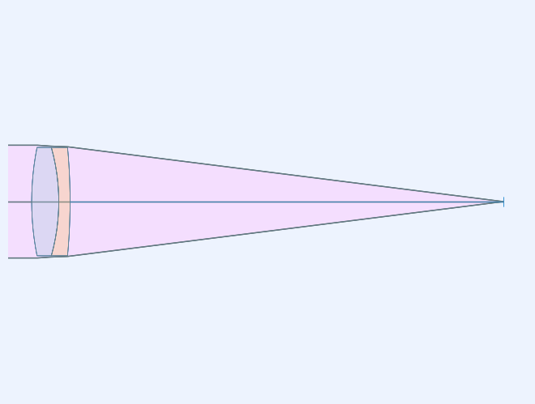
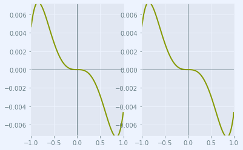
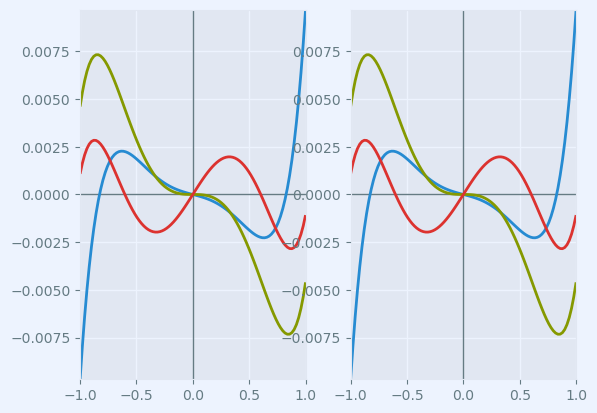

.. currentmodule:: rayoptics

###########################
Edmund catalog lens example
###########################

This notebook shows the steps to follow to open a CODE V seq file of a Edmund achromatic doublet.

.. code:: ipython3

    %matplotlib inline

.. code:: ipython3

    # initialization
    from rayoptics.environment import *

Use the object oriented filesystem interface from Python 3
----------------------------------------------------------

.. code:: ipython3

    root_pth = Path(rayoptics.__file__).resolve().parent

Read CODE V seq file for Edmund part 32-327, Achromatic Lens
------------------------------------------------------------

Use the :func:`~.gui.appcmds.open_model` function to read CODE V **.seq** files, Zemax **.zmx** files, and the native rayoptics JSON files, **.roa**

It returns an instance of :class:`~.opticalmodel.OpticalModel` that contains all of the model data.

.. code:: ipython3

    opm = open_model(root_pth/"codev/tests/CODV_32327.seq")

Setup convenient aliases for using rayoptics functions

.. code:: ipython3

    sm  = opm['seq_model']
    osp = opm['optical_spec']
    pm = opm['parax_model']
    em = opm['ele_model']
    pt = opm['part_tree']
    ar = opm['analysis_results']

.. code:: ipython3

    sm.list_model()

.. parsed-literal::

                  r            t        medium     mode   zdr      sd
      Obj:     0.000000  1.00000e+13       air             1      1.0000
    32327:    61.470000      6.00000     N-BK7             1      12.000
        2:   -44.640000      2.50000     N-SF5             1      1.0000
        3:  -129.940000      95.9519       air             1      12.000
      Img:     0.000000      0.00000                       1      1.0000

.. code:: ipython3

    sm.list_sg()

.. parsed-literal::

                   r               mode              type          y       alpha
                           t           medium
      Obj:      0.00000                 
                     1.00000e+13          air
    32327:      61.4700                 
                         6.00000        N-BK7
        2:     -44.6400                 
                         2.50000        N-SF5
        3:     -129.940                 
                         95.9519          air
      Img:      0.00000                 

Display first order properties of the model
-------------------------------------------

The calculated first order data is in the :class:`~.firstorder.FirstOrderData` class.
An instance of :class:`~.FirstOrderData` is maintained in `OpticalModel['analysis_results']` under the key `parax_data`.

Other essential optical specification data is also managed by the :class:`~.opticalspec.OpticalSpecs` class:

    - spectral_region (:class:`~.opticalspec.WvlSpec`)
    - pupil (:class:`~.opticalspec.PupilSpec`)
    - field_of_view (:class:`~.opticalspec.FieldSpec`)
    - defocus (:class:`~.opticalspec.FocusRange`)

A convenience method in :class:`~.ParaxialModel`, :meth:`~.paraxialdesign.ParaxialModel.first_order_data`, can be used to display the first order properties of the model.

.. code:: ipython3

    pm.first_order_data()

.. parsed-literal::

    efl                 100
    f                   100
    f'                  100
    ffl              -98.58
    pp1               1.451
    bfl               95.95
    ppk              -4.079
    pp sep             2.97
    f/#               4.001
    m                -1e-11
    red          -9.997e+10
    obj_dist          1e+13
    obj_ang               1
    enp_dist             -0
    enp_radius         12.5
    na obj         1.25e-12
    n obj                 1
    img_dist          95.95
    img_ht            1.746
    exp_dist         -5.551
    exp_radius        12.68
    na img           -0.124
    n img                 1
    optical invariant       0.2182

Generate a lens picture
-----------------------

This is done using the :mod:`.interactivelayout` module.
All graphics in rayoptics are based on matplotlib.

.. code:: ipython3

    layout_plt = plt.figure(FigureClass=InteractiveLayout, opt_model=opm,
                            do_draw_rays=True, do_paraxial_layout=False).plot()

Draw a transverse ray aberration plot
-------------------------------------

This is done using the :mod:`.axisarrayfigure` module.

.. code:: ipython3

    abr_plt = plt.figure(FigureClass=RayFanFigure, opt_model=opm, data_type='Ray',
                         scale_type=Fit.All_Same).plot()

The model in the CODE V seq file only had 1 wavelength defined. Use the :class:`~.opticalspec.OpticalSpecs` instance, `osp`, to modify the :attr:`~.opticalspec.OpticalSpecs.spectral_region` in the optical subpackage to add wavelengths in the red and blue. The wavelenghts can be specified directly in nm or by using spectral line designations, as done here.

.. code:: ipython3

    osp['wvls'].set_from_list([['F', 1], ['d', 2], ['C', 1]])
    osp['wvls'].reference_wvl = 1

.. code:: ipython3

    osp['wvls'].wavelengths

.. parsed-literal::

    [486.1327, 587.5618, 656.2725]

After changing the wavelengths, update the optical model using :meth:`~.OpticalModel.update_model` to ensure all of the data is consistent.
The :class:`~.opticalmodel.OpticalModel` class is in the :mod:`~.opticalmodel` module in the :mod:`~.optical` subpackage.

.. code:: ipython3

    opm.update_model()

The aberration plot can be updated by calling :meth:`~.axisarrayfigure.AxisArrayFigure.refresh` on abr_plt

.. code:: ipython3

    abr_plt.refresh()

