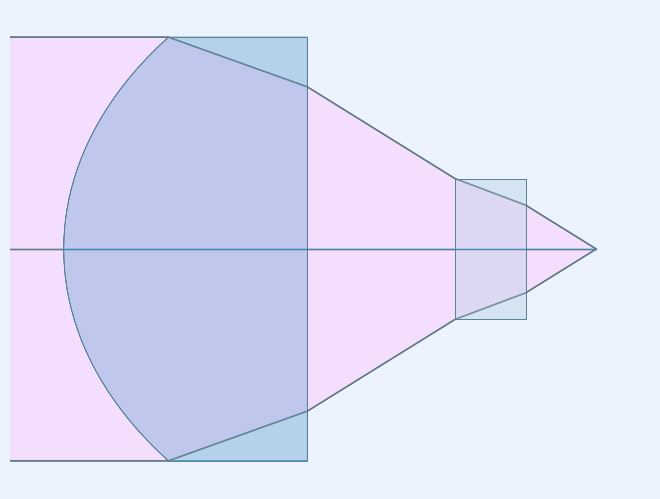
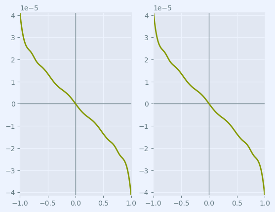
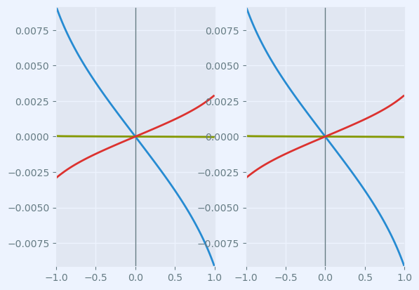
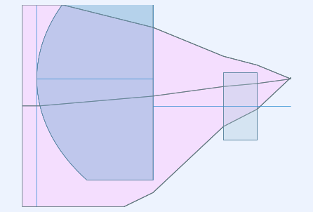

.. currentmodule:: rayoptics

#############################
ThorLabs catalog lens example
#############################

This notebook shows the steps to follow to open a Zemax zmx file of a ThorLabs aspheric singlet

.. code:: ipython3

    %matplotlib inline

.. code:: ipython3

    # initialization
    from rayoptics.environment import *

Read Zemax .zmx file for ThorLabs part 354710-C
-----------------------------------------------

Use the :func:`~.gui.appcmds.open_model` function to read Zemax **.zmx** files, CODE V **.seq** files and the native rayoptics JSON files, **.roa**

It returns an instance of :class:`~.opticalmodel.OpticalModel` that contains all of the model data.

Use the info keyword argument to get additional information about the details of the imported file.

The webpage for the 354710-C aspheric lens is `here <https://www.thorlabs.com/thorproduct.cfm?partnumber=354710-C>`_ 

.. code:: ipython3

    opm, info = open_model(Path.cwd() / "354710-C-Zemax(ZMX).zmx", info=True)

info is a tuple of the following items:

    - the track_contents dict 
    - glasses not found dict

.. code:: ipython3

    info

.. parsed-literal::

    ({'VERS': '140124 258 36214',
      'pupil': ('aperture', 'object', 'epd'),
      'FTYP': '0 0 1 1 0 0 0',
      'STANDARD': 5,
      '# clear ap': 6,
      'EVENASPH': 1,
      'CONI': 1,
      'conj type': 'infinite',
      '# surfs': 6,
      '# wvls': 1,
      'fov': ('field', 'object', 'angle'),
      '# fields': 1,
      'GCAT': ['LIGHTPATH', 'SCHOTT'],
      'glass substituted': 2,
      'encoding': 'utf-16'},
     {'D-ZK3M': ('D-ZK3', 'CDGM'), 'BK7': ('BK7', 'Robb1983.SCHOTT')})

The second dict indicates that there were two glasses in the model file that are not in the glass catalog set that ray-optics uses from the opticalglass package. There is a file called 354710-C-Zemax(ZMX)_tmpl.smx that contains the glasses not found dict dict.

One is a substitute material. One of the glasses was named BK7, and that's not an exact match in the current Schott catalog. But there is a similar glass N-BK7, and what the import process did was substitute that glass for the BK7 glass. 

The other glass here isn't in any of the ray-optics catalogs, and it apparently is from the LightPath catalog, as indicated by the 'GCAT' key in the track contents dict. A web search leads to this `D-ZK3M datasheet <https://www.amstechnologies-webshop.com/media/pdf/e9/04/26/D-ZK3.pdf>`_. 

One thing of importance is what wavelength this material is going to be used. The usual convenient way of specifying an optical glass with the index and V number is really only adequate in the visible wavelengths. In this case, the lens file is going to be used in the infrared, at 1550 nanometers. Fortunately there are adequate data points for the material definition in the IR.

The best approach to using the available data is to interpolate refractive index values from the refractive index table in the datasheet. There is a material model in the :mod:`opticalglass.opticalmedium` package called :class:`opticalglass.opticalmedium.InterpolatedMedium` that takes a glass name, a catalog name, and a list of wavelength/refractive index pairs. The template .smx file is edited with new InterpolatedMedium definition for D-ZK3M and saved with the same name as the .zmx file but with a .smx extender. The template file can be deleted, because it's no longer needed.

The name of this file should be the same as the name of the original Zemax file. But instead of an extender of zmx use an extender of smx, so when we do that, we now have an smx file right next to it. We can delete the template file, because that's no longer needed.

Open the model again.

.. code:: ipython3

    opm, info = open_model(Path.cwd() / "354710-C-Zemax(ZMX).zmx", info=True)

.. code:: ipython3

    info

.. parsed-literal::

    ({'VERS': '140124 258 36214',
      'pupil': ('aperture', 'object', 'epd'),
      'FTYP': '0 0 1 1 0 0 0',
      'STANDARD': 5,
      '# clear ap': 6,
      'EVENASPH': 1,
      'CONI': 1,
      'conj type': 'infinite',
      '# surfs': 6,
      '# wvls': 1,
      'fov': ('field', 'object', 'angle'),
      '# fields': 1,
      'GCAT': ['LIGHTPATH', 'SCHOTT'],
      'encoding': 'utf-16'},
     {'BK7': ['N-BK7', 'Schott'],
      'D-ZK3M': "om.InterpolatedMedium('D-ZK3M', cat='LightPath', pairs=[(2352.4, 1.555),(1970.1, 1.561),(1529.6, 1.568),(1128.6, 1.573),(1014.0, 1.575),(852.1, 1.578),(706.5, 1.582),(656.3, 1.583),(643.8, 1.584),(632.8, 1.584),(589.3, 1.586),(587.6,1.586),(546.1, 1.589),(486.1, 1.593),(480.0, 1.594),(435.8, 1.598),(404.7, 1.602),(365.0, 1.610)])"})

Examining the info, the InterpolatedMedium definition for D-ZK3M is being used as well as the N-BK7 substitution for BK7. All of the flags for glass not found or glass substituted have been resolved.

Setup convenient aliases for using rayoptics functions

.. code:: ipython3

    sm  = opm['seq_model']
    osp = opm['optical_spec']
    pm = opm['parax_model']
    em = opm['ele_model']
    pt = opm['part_tree']
    ar = opm['analysis_results']

.. code:: ipython3

    osp['wvls'].wavelengths

.. parsed-literal::

    [1550.0]

.. code:: ipython3

    sm.list_model()

.. parsed-literal::

                  c            t        medium     mode   zdr      sd
      Obj:     0.000000  1.00000e+10       air             1      1.0000
     Stop:     1.182174     0.862527    D-ZK3M             1     0.75000
        2:     0.000000     0.523243       air             1     0.57417
        3:     0.000000     0.250000     N-BK7             1     0.24917
        4:     0.000000     0.249999       air             1     0.15527
      Img:     0.000000      0.00000                       1  8.9134e-06

Display first order properties of the model
-------------------------------------------

The calculated first order data is in the :class:`~.firstorder.FirstOrderData` class.
An instance of :class:`~.FirstOrderData` is maintained in `OpticalModel['analysis_results']` under the key `parax_data`.

Other essential optical specification data is also managed by the :class:`~.opticalspec.OpticalSpecs` class:

    - spectral_region (:class:`~.opticalspec.WvlSpec`)
    - pupil (:class:`~.opticalspec.PupilSpec`)
    - field_of_view (:class:`~.opticalspec.FieldSpec`)
    - defocus (:class:`~.opticalspec.FocusRange`)

A convenience method in :class:`~.ParaxialModel`, :meth:`~.paraxialdesign.ParaxialModel.first_order_data`, can be used to display the first order properties of the model.

.. code:: ipython3

    pm.first_order_data()

.. parsed-literal::

    efl                1.49
    f                  1.49
    f'                 1.49
    ffl               -1.49
    pp1                   0
    bfl              0.2499
    ppk               -1.24
    pp sep           0.3958
    f/#              0.9933
    m             -1.49e-10
    red          -6.712e+09
    obj_dist          1e+10
    obj_ang               1
    enp_dist             -0
    enp_radius         0.75
    na obj          7.5e-11
    n obj                 1
    img_dist         0.2499
    img_ht          0.02601
    exp_dist          -1.24
    exp_radius         0.75
    na img          -0.4496
    n img                 1
    optical invariant      0.01309

Generate a lens picture
-----------------------

This is done using the :mod:`.interactivelayout` module.
All graphics in rayoptics are based on matplotlib.

.. code:: ipython3

    layout_plt = plt.figure(FigureClass=InteractiveLayout, opt_model=opm,
                            do_draw_rays=True, do_paraxial_layout=False).plot()

Draw a transverse ray aberration plot
-------------------------------------

This is done using the :mod:`.axisarrayfigure` module.

.. code:: ipython3

    abr_plt = plt.figure(FigureClass=RayFanFigure, opt_model=opm, data_type='Ray',
                         scale_type=Fit.All_Same).plot()

The model from ThorLabs only had 1 wavelength defined. Use the :class:`~.opticalspec.OpticalSpecs` instance, `osp`, to modify the :attr:`~.opticalspec.OpticalSpecs.spectral_region` in the optical subpackage to add wavelengths in the red and blue. The wavelenghts can be specified directly in nm or by using spectral line designations.

.. code:: ipython3

    osp['wvls'].set_from_list([[1050., 1], [1550., 2], [1700., 1]])
    osp['wvls'].reference_wvl = 1

.. code:: ipython3

    osp['wvls'].wavelengths

.. parsed-literal::

    [1050.0, 1550.0, 1700.0]

After changing the wavelengths, update the optical model using :meth:`~.OpticalModel.update_model` to ensure all of the data is consistent.
The :class:`~.opticalmodel.OpticalModel` class is in the :mod:`~.opticalmodel` module in the :mod:`~.optical` subpackage.

.. code:: ipython3

    opm.update_model()

The aberration plot can be updated by calling :meth:`~.axisarrayfigure.AxisArrayFigure.refresh` on abr_plt

.. code:: ipython3

    abr_plt.refresh()

List the model, and use an alternate model listing command, list_sg, for "list surface and gap". This is useful because it will allow us to look at element decenters or surface decenters in our model.

.. code:: ipython3

    sm.list_model()

.. parsed-literal::

                  c            t        medium     mode   zdr      sd
      Obj:     0.000000  1.00000e+10       air             1      1.0000
     Stop:     1.182174     0.862527    D-ZK3M             1     0.75000
        2:     0.000000     0.523243       air             1     0.57417
        3:     0.000000     0.250000     N-BK7             1     0.24917
        4:     0.000000     0.249999       air             1     0.15527
      Img:     0.000000      0.00000                       1  8.9134e-06

.. code:: ipython3

    sm.list_sg()

.. parsed-literal::

                   c               mode              type          y       alpha
                           t           medium
      Obj:      0.00000                 
                     1.00000e+10          air
     Stop:      1.18217                 
                        0.862527       D-ZK3M
        2:      0.00000                 
                        0.523243          air
        3:      0.00000                 
                        0.250000        N-BK7
        4:      0.00000                 
                        0.249999          air
      Img:      0.00000                 

So we just take a quick look at what the actual surface definition is. We see the first surface has an even polynomial: a sphere with a conic constant, and aspheric coefficients, up to 12th order, and it's a transmitting surface.

.. code:: ipython3

    listobj(sm.ifcs[1])

.. parsed-literal::

    transmit
    profile: EvenPolynomial
    c=1.1821736792829385,   r=0.8458993949235631   conic cnst=-0.4776343430417
    coefficients: [0.0, -0.006313587842251, -0.009394960901464, -0.01707674864971, 0.008070222726967, -0.02139444912229, 0.0, 0.0]
    surface_od=0.75
    ca: radius=0.75
    

Now add decentered surfaces to both the first and the second surface of the lens element. These surfaces are defined as a local decenter type and a reverse decenter. A local decenter applies a translation first, and then a rotation, whereas the reverse decenter applies the reverse: the inverse of the rotation matrix, and then subtracting the translation. 

.. code:: ipython3

    sm.ifcs[1].decenter = srf.DecenterData('decenter')
    sm.ifcs[2].decenter = srf.DecenterData('reverse')

Listing the model shows the decentered parameters.

.. code:: ipython3

    sm.list_sg()

.. parsed-literal::

                   c               mode              type          y       alpha
                           t           medium
      Obj:      0.00000                 
                     1.00000e+10          air
     Stop:      1.18217                            decenter     0.0000     0.0000
                        0.862527       D-ZK3M
        2:      0.00000                             reverse     0.0000     0.0000
                        0.523243          air
        3:      0.00000                 
                        0.250000        N-BK7
        4:      0.00000                 
                        0.249999          air
      Img:      0.00000                 

The decenter is defined by a translation, the tilt is defined by alpha, beta, and gamma euler angles. The euler angles will be converted into a rotation matrix. So, this information gives you a translation and a rotation matrix.

.. code:: ipython3

    listobj(sm.ifcs[1])

.. parsed-literal::

    transmit
    profile: EvenPolynomial
    c=1.1821736792829385,   r=0.8458993949235631   conic cnst=-0.4776343430417
    coefficients: [0.0, -0.006313587842251, -0.009394960901464, -0.01707674864971, 0.008070222726967, -0.02139444912229, 0.0, 0.0]
    decenter type: decenter
    decenter: [0. 0. 0.]
    euler angles: [0. 0. 0.]
    surface_od=0.75
    ca: radius=0.75
    

To laterally offset the lens element in the y direction, say by 0.2 millimeters, set the second element of the translation vector of each of the surfaces to 0.2. And because the second surface is a reverse decenter we'll see that the optical axis comes back to the original position. So now we've decentered the surfaces we see that the y component value is 0.2. 

.. code:: ipython3

    sm.ifcs[1].decenter.dec[1] = .2
    sm.ifcs[2].decenter.dec[1] = .2

.. code:: ipython3

    listobj(sm.ifcs[1])

.. parsed-literal::

    transmit
    profile: EvenPolynomial
    c=1.1821736792829385,   r=0.8458993949235631   conic cnst=-0.4776343430417
    coefficients: [0.0, -0.006313587842251, -0.009394960901464, -0.01707674864971, 0.008070222726967, -0.02139444912229, 0.0, 0.0]
    decenter type: decenter
    decenter: [0.  0.2 0. ]
    euler angles: [0. 0. 0.]
    surface_od=0.75
    ca: radius=0.75
    

.. code:: ipython3

    sm.list_sg()

.. parsed-literal::

                   c               mode              type          y       alpha
                           t           medium
      Obj:      0.00000                 
                     1.00000e+10          air
     Stop:      1.18217                            decenter    0.20000     0.0000
                        0.862527       D-ZK3M
        2:      0.00000                             reverse    0.20000     0.0000
                        0.523243          air
        3:      0.00000                 
                        0.250000        N-BK7
        4:      0.00000                 
                        0.249999          air
      Img:      0.00000                 

When perturbing the lens position, we want the ray bundle to stay directed along the axis. So we want to separate the definition of the stop surface from the first surface, and put the stop on a dummy plane in front of the lens element. So when the lens element is laterally shifted, the stop plane, which is what the rays are aimed at, will stay the same.

Add a dummy plane, following the object surface. I'll list the model, and we see here, the dummy plane, and the current surface should be the surface that we did the insert at so that's surface one, and we want to set the stop to the current surface. And when we redo the listing, we see the stop is moved to the dummy plane. We have laterally offset the second and third surfaces by an amount of 0.2, 

.. code:: ipython3

    opm.add_dummy_plane(idx=0)

.. code:: ipython3

    sm.list_sg()

.. parsed-literal::

                   c               mode              type          y       alpha
                           t           medium
      Obj:      0.00000                 
                     1.00000e+10          air
        1:      0.00000                 
                         0.00000          air
     Stop:      1.18217                            decenter    0.20000     0.0000
                        0.862527       D-ZK3M
        3:      0.00000                             reverse    0.20000     0.0000
                        0.523243          air
        4:      0.00000                 
                        0.250000        N-BK7
        5:      0.00000                 
                        0.249999          air
      Img:      0.00000                 

.. code:: ipython3

    sm.cur_surface

.. parsed-literal::

    1

.. code:: ipython3

    sm.set_stop()

.. parsed-literal::

    1

.. code:: ipython3

    sm.list_sg()

.. parsed-literal::

                   c               mode              type          y       alpha
                           t           medium
      Obj:      0.00000                 
                     1.00000e+10          air
     Stop:      0.00000                 
                         0.00000          air
        2:      1.18217                            decenter    0.20000     0.0000
                        0.862527       D-ZK3M
        3:      0.00000                             reverse    0.20000     0.0000
                        0.523243          air
        4:      0.00000                 
                        0.250000        N-BK7
        5:      0.00000                 
                        0.249999          air
      Img:      0.00000                 

.. code:: ipython3

    sm.list_decenters(full=True)

.. parsed-literal::

                  thi    medium/mode          type          x          y       alpha      beta       gamma
        0:  1.00000e+10          air
        1:      0.00000          air
        2:                                  decenter     0.0000    0.20000     0.0000     0.0000     0.0000
               0.862527       D-ZK3M
        3:                                   reverse     0.0000    0.20000     0.0000     0.0000     0.0000
               0.523243          air
        4:     0.250000        N-BK7
        5:     0.249999          air
        6:                     dummy

Now update the model and redraw the layout. Note that the lens element has shifted upward by 0.2 millimeters. The original ray fan is is unperturbed in object space but note that it gets deflected off axis, and in fact the aberration is large enough that flare is visible, even on the lens layout.

.. code:: ipython3

    opm.update_model()

.. code:: ipython3

    layout_plt.refresh()

Now refresh the aberration plot to see what the aberrations look like now. Notice the scale size is now about two and a half times larger than it was just previously. Across the center of the aperture you're pretty well corrected but there is some flare occurring at the lower edge of the aperture. 

.. code:: ipython3

    abr_plt.refresh()

.. image:: output_55_0.png

.. code:: ipython3

    listobj(sm)

.. parsed-literal::

    0: Obj: dummy
    profile: Spherical
    c=0.0,   r=0.0
    surface_od=1.0
    ca: radius=1.0
    t=10000000000.0 (+1);    medium: air
    
    1 (stop): dummy
    profile: Spherical
    c=0.0,   r=0.0
    surface_od=1.0
    t=0.0 (+1);    medium: air
    
    2: transmit
    profile: EvenPolynomial
    c=1.1821736792829385,   r=0.8458993949235631   conic cnst=-0.4776343430417
    coefficients: [0.0, -0.006313587842251, -0.009394960901464, -0.01707674864971, 0.008070222726967, -0.02139444912229, 0.0, 0.0]
    decenter type: decenter
    decenter: [0.  0.2 0. ]
    euler angles: [0. 0. 0.]
    surface_od=0.75
    ca: radius=0.75
    t=0.8625269152715 (+1);    medium: D-ZK3M, LightPath
    
    3: transmit
    profile: Spherical
    c=0.0,   r=0.0
    decenter type: reverse
    decenter: [0.  0.2 0. ]
    euler angles: [0. 0. 0.]
    surface_od=0.5741712000783
    ca: radius=0.5741712000783
    t=0.5232428185297 (+1);    medium: air
    
    4: transmit
    profile: Spherical
    c=0.0,   r=0.0
    surface_od=0.2491691582457
    ca: radius=0.2491691582457
    t=0.25 (+1);    medium: N-BK7, Schott
    
    5: transmit
    profile: Spherical
    c=0.0,   r=0.0
    surface_od=0.1552731950841
    ca: radius=0.1552731950841
    t=0.2499991927943 (+1);    medium: air
    
    6: Img: dummy
    profile: Spherical
    c=0.0,   r=0.0
    surface_od=8.913407958194e-06
    ca: radius=8.913407958194e-06
    
    do apertures: False

