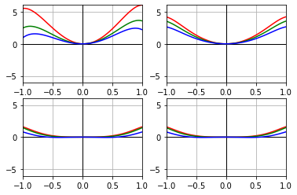
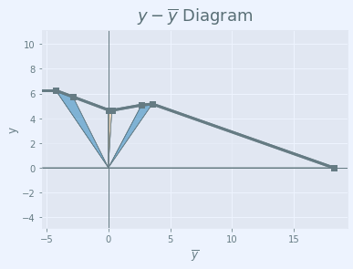
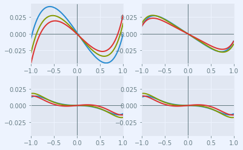
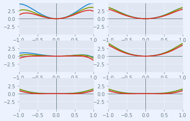
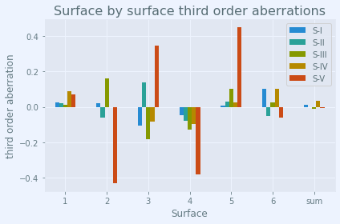

.. currentmodule:: rayoptics.optical

###############
Triplet example
###############

This triplet design, used in Jose Sasian's `Lens Design OPTI 517 <https://wp.optics.arizona.edu/jsasian/courses/opti-517/>`_ course at the Univ. of Arizona, is attributed to Geiser.

.. code:: ipython3

    %matplotlib inline

.. code:: ipython3

    isdark = False

Setup the rayoptics environment
-------------------------------

The ``environment.py`` module imports many useful classes and functions. All the symbols defined in the module are intended to be imported into a rayoptics interactive session.

.. code:: ipython3

    from rayoptics.environment import *

Create a new model
------------------

Create a new :class:`~opticalmodel.OpticalModel` instance and set up some convenient aliases to important constituents of the model.

.. code:: ipython3

    opm = OpticalModel()
    sm  = opm.seq_model
    osp = opm.optical_spec
    pm = opm.parax_model

Define first order aperture and field for system
~~~~~~~~~~~~~~~~~~~~~~~~~~~~~~~~~~~~~~~~~~~~~~~~

The pupil and field specifications can be specified in a variety of
ways. The ``key`` keyword argument takes a list of 2 strings. The first
string indicates whether the specification is in object or image space.
The second one indicates which parameter is the defining specification.

The PupilSpec can be defined in object or image space. The defining
parameters can be ``pupil``, ``f/#`` or ``NA``, where ``pupil`` is the
pupil diameter.

.. code:: ipython3

    osp.pupil = PupilSpec(osp, key=['object', 'pupil'], value=12.5)

The FieldSpec can be defined in object or image space. The defining
parameters can be ``height`` or ``angle``, where ``angle`` is given in
degrees.

.. code:: ipython3

    osp.field_of_view = FieldSpec(osp, key=['object', 'angle'], flds=[0., 20.0])

The WvlSpec defines the wavelengths and weights to use when evaluating
the model. The wavelength values can be given in either nanometers or a
spectral line designation.

.. code:: ipython3

    osp.spectral_region = WvlSpec([('F', 0.5), (587.5618, 1.0), ('C', 0.5)], ref_wl=1)

Define interface and gap data for the sequential model
~~~~~~~~~~~~~~~~~~~~~~~~~~~~~~~~~~~~~~~~~~~~~~~~~~~~~~

.. code:: ipython3

    opm.radius_mode = True
    
    sm.gaps[0].thi=1e10
    
    sm.add_surface([23.713, 4.831, 'N-LAK9', 'Schott'])
    sm.add_surface([7331.288, 5.86])
    sm.add_surface([-24.456, .975, 'N-SF5', 'Schott'])
    sm.set_stop()
    sm.add_surface([21.896, 4.822])
    sm.add_surface([86.759, 3.127, 'N-LAK9', 'Schott'])
    sm.add_surface([-20.4942, 41.2365])

Update the model
~~~~~~~~~~~~~~~~

.. code:: ipython3

    opm.update_model()

Draw a lens picture
-------------------

.. code:: ipython3

    layout_plt = plt.figure(FigureClass=InteractiveLayout, opt_model=opm, do_draw_rays=True, do_paraxial_layout=False,
                            is_dark=isdark).plot()

.. code:: ipython3

    opm.ele_model.list_elements()

.. parsed-literal::

    0: E1 (Element): Element: Spherical(c=0.042170961076202926), Spherical(c=0.00013640168003221264), t=4.8310, sd=10.0087, glass: N-LAK9
    1: AirGap E1-E2 (AirGap): Gap(t=5.86, medium=Air)
    2: E2 (Element): Element: Spherical(c=-0.04088976120379457), Spherical(c=0.04567044208987943), t=0.9750, sd=4.7919, glass: N-SF5
    3: AirGap E2-E3 (AirGap): Gap(t=4.822, medium=Air)
    4: E3 (Element): Element: Spherical(c=0.011526181721781025), Spherical(c=-0.04879429301948844), t=3.1270, sd=8.3321, glass: N-LAK9
    5: AirGap E3-Image (AirGap): Gap(t=41.2365, medium=Air)
    6: Image (DummyInterface): Surface(lbl='Img', profile=Spherical(c=0.0), interact_mode=transmit)

Draw a |ybar| diagram
---------------------

.. code:: ipython3

    yybar_plt = plt.figure(FigureClass=InteractiveDiagram, opt_model=opm, dgm_type='ht',
                           do_draw_axes=True, do_draw_frame=True, is_dark=isdark).plot()

Plot the transverse ray aberrations
-----------------------------------

.. code:: ipython3

    abr_plt = plt.figure(FigureClass=RayFanFigure, opt_model=opm, data_type='Ray', scale_type=Fit.All_Same, is_dark=isdark).plot()

Plot the wavefront aberration
-----------------------------

.. code:: ipython3

    wav_plt = plt.figure(FigureClass=RayFanFigure, opt_model=opm, data_type='OPD', scale_type=Fit.All_Same, is_dark=isdark).plot()

List the optical specifications
-------------------------------

.. code:: ipython3

    pm.first_order_data()

.. parsed-literal::

    efl                  50
    ffl               -37.1
    pp1                12.9
    bfl               41.24
    ppk               8.763
    f/#                   4
    m             2.298e-05
    red              -2e+08
    obj_dist          1e+10
    obj_ang              20
    enp_dist          11.68
    enp_radius         6.25
    na obj         6.25e-10
    n obj                 1
    img_dist          41.24
    img_ht             18.2
    exp_dist         -10.01
    exp_radius        6.406
    na img           -0.124
    n img                 1
    optical invariant        2.275

List the paraxial model
-----------------------

.. code:: ipython3

    pm.list_lens()

.. parsed-literal::

           ax_ray_ht    ax_ray_slp
     0:            0      6.25e-10
     1:         6.25     -0.182126
     2:       5.7297     -0.181586
     3:       4.6656    -0.0532508
     4:       4.6346     0.0891357
     5:       5.0644        0.0488
     6:       5.1546     -0.124998
     7:   0.00014365     -0.124998
    
           pr_ray_ht    pr_ray_slp
     0:  -3.6397e+09       0.36397
     1:      -4.2509      0.487842
     2:      -2.8572      0.487573
     3:   3.5341e-07      0.487573
     4:       0.2842      0.496304
     5:       2.6774       0.47498
     6:       3.5557      0.355092
     7:       18.198      0.355092
    
                power           tau        index    type
     0:             0         1e+10      1.00000    transmit
     1:    0.02914022        2.8569      1.69100    transmit
     2: -9.425384e-05          5.86      1.00000    transmit
     3:   -0.02750683       0.58289      1.67271    transmit
     4:   -0.03072283         4.822      1.00000    transmit
     5:   0.007964615        1.8492      1.69100    transmit
     6:    0.03371696        41.236      1.00000    transmit
     7:             0             0      1.00000    transmit

Third Order Seidel aberrations
------------------------------

Computation and tabular display
~~~~~~~~~~~~~~~~~~~~~~~~~~~~~~~

.. code:: ipython3

    to_pkg = compute_third_order(opm)
    to_pkg

.. raw:: html

    

    
    <table border="1" class="dataframe">
      <thead>
        <tr style="text-align: right;">
          <th></th>
          <th>S-I</th>
          <th>S-II</th>
          <th>S-III</th>
          <th>S-IV</th>
          <th>S-V</th>
        </tr>
      </thead>
      <tbody>
        <tr>
          <th>1</th>
          <td>0.027654</td>
          <td>0.019379</td>
          <td>0.013581</td>
          <td>0.089174</td>
          <td>0.072010</td>
        </tr>
        <tr>
          <th>2</th>
          <td>0.022082</td>
          <td>-0.059501</td>
          <td>0.160327</td>
          <td>-0.000288</td>
          <td>-0.431229</td>
        </tr>
        <tr>
          <th>3</th>
          <td>-0.105156</td>
          <td>0.137692</td>
          <td>-0.180295</td>
          <td>-0.085097</td>
          <td>0.347506</td>
        </tr>
        <tr>
          <th>4</th>
          <td>-0.045358</td>
          <td>-0.076796</td>
          <td>-0.130024</td>
          <td>-0.095046</td>
          <td>-0.381069</td>
        </tr>
        <tr>
          <th>5</th>
          <td>0.007942</td>
          <td>0.028382</td>
          <td>0.101431</td>
          <td>0.024373</td>
          <td>0.449596</td>
        </tr>
        <tr>
          <th>6</th>
          <td>0.103810</td>
          <td>-0.050068</td>
          <td>0.024148</td>
          <td>0.103180</td>
          <td>-0.061411</td>
        </tr>
        <tr>
          <th>sum</th>
          <td>0.010973</td>
          <td>-0.000912</td>
          <td>-0.010832</td>
          <td>0.036297</td>
          <td>-0.004597</td>
        </tr>
      </tbody>
    </table>
    

Bar chart for surface by surface third order aberrations
~~~~~~~~~~~~~~~~~~~~~~~~~~~~~~~~~~~~~~~~~~~~~~~~~~~~~~~~

.. code:: ipython3

    fig, ax = plt.subplots()
    ax.set_xlabel('Surface')
    ax.set_ylabel('third order aberration')
    ax.set_title('Surface by surface third order aberrations')
    to_pkg.plot.bar(ax=ax, rot=0)
    ax.grid(True)
    fig.tight_layout()

convert aberration sums to transverse measure
~~~~~~~~~~~~~~~~~~~~~~~~~~~~~~~~~~~~~~~~~~~~~

.. code:: ipython3

    ax_ray, pr_ray, fod = osp.parax_data
    n_last = pm.sys[-1][mc.indx]
    u_last = ax_ray[-1][mc.slp]
    to.seidel_to_transverse_aberration(to_pkg.loc['sum',:], n_last, u_last)

.. parsed-literal::

    TSA   -0.043893
    TCO    0.010944
    TAS   -0.015198
    SAS   -0.101860
    PTB   -0.145190
    DST    0.018387
    dtype: float64

convert sums to wavefront measure
~~~~~~~~~~~~~~~~~~~~~~~~~~~~~~~~~

.. code:: ipython3

    central_wv = opm.nm_to_sys_units(sm.central_wavelength())
    to.seidel_to_wavefront(to_pkg.loc['sum',:], central_wv).T

.. parsed-literal::

    W040     2.334457
    W131    -0.776108
    W222    -9.218154
    W220    10.834770
    W311    -3.911650
    dtype: float64

compute Petzval, sagittal and tangential field curvature
~~~~~~~~~~~~~~~~~~~~~~~~~~~~~~~~~~~~~~~~~~~~~~~~~~~~~~~~

.. code:: ipython3

    to.seidel_to_field_curv(to_pkg.loc['sum',:], n_last, fod.opt_inv)

.. parsed-literal::

    TCV    0.000734
    SCV    0.004921
    PCV    0.007014
    dtype: float64

Save the model
--------------

.. code:: ipython3

    opm.save_model('Sasian Triplet')

