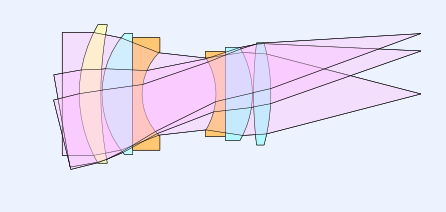

.. ray-optics documentation master file, created by
   sphinx-quickstart on Tue Feb 11 10:20:36 2020.
   You can adapt this file completely to your liking, but it should at least
   contain the root `toctree` directive.

:tocdepth: 6

#######################
RayOptics Documentation
#######################

RayOptics is a Python geometrical optics and image forming optics library. It provides a geometric ray tracing foundation for the analysis of image forming and coherent optical systems. A number of standard geometrical analysis options such as transverse ray and wavefront aberration analysis are provided on this base. Paraxial layout of optical systems is also supported by |ybar| and |nubar| diagrams and graphical editing of paraxial rays in lens layout views. Import of Zemax .zmx and CODEV .seq files is supported. RayOptics can be used in Python scripts, the Python and IPython shells, the Jupyter notebook, and a Qt-based graphical user interface application.

.. toctree::
   :maxdepth: 1
   :caption: Contents

   Introduction

.. _getting-started:

.. toctree::
   :maxdepth: 1
   :caption: Getting Started

   install
   userguide/scripting
   userguide/qt_app

.. _examples:

.. toctree::
   :maxdepth: 1
   :caption: Examples

   examples/SasianTriplet/SasianTriplet
   examples/AddFromFileAndFlip/AddFromFileAndFlip
   examples/Cell_Phone_lens/Cell_Phone_lens
   examples/ThorlabsLensImport/ThorlabsLensImport
   examples/EdmundLensImport/EdmundLensImport

.. _user-docs:

.. toctree::
   :maxdepth: 2
   :caption: User Guide

   models/index
   optical/index

.. _dev-guide:

.. toctree::
   :maxdepth: 3
   :caption: Developer Guide

   devguide/index
   Module Reference <api/rayoptics>
   devguide/roa_file_definition

.. _misc-items:

.. toctree::
   :maxdepth: 1
   :caption: Miscellaneous

   Authors <authors>
   License <license>
   Changelog <changelog>

Indices and tables
==================

* :ref:`genindex`
* :ref:`modindex`
* :ref:`search`
